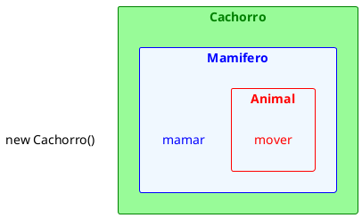
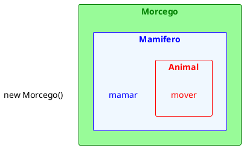

# Exercício de Herança 1

1. Considere o código abaixo, que utiliza as classes da UML apresentada, e indique, caso exista algum erro, a linha e qual o erro.

<figure>

```plantuml
Nos trechos:
Mamifero m1 = new Animal();
Cachorro c1 = new Animal();
Cachorro c2 = new Mamifero();
Morcego mo1 = new Animal();
Morcego mo2 = new Mamifero();

Tem um erro de hierarquia, onde as classes mais altas na hierarquia da herança estão tentando ser convertidas para classes mais baixas.

Nos trechos:
Cachorro c4 = new Morcego();
Morcego mo3 = new Cachorro();
Morcego mo6 = a6;

Um morcego e um cachorro são classes irmãs na hierarquia. Não há relação de herança direta entre eles.

No trecho:
Animal a5 = new Cachorro();
a5.mamar();

O metodo mamar não é da Classe animal pra ser chamada e sim de mamifero

```

<figcaption>Relação entre Animal, Mamímero, Morcego e Cachorro.</figcaption>
</figure>

@[code](../code/heranca/code1.java)

@[code](../code/heranca/code2.java)


<figure>



<figcaption>Criando um objeto Cachorro.</figcaption>
</figure>

<figure>



<figcaption>Criando um objeto Morcego.</figcaption>
</figure>

